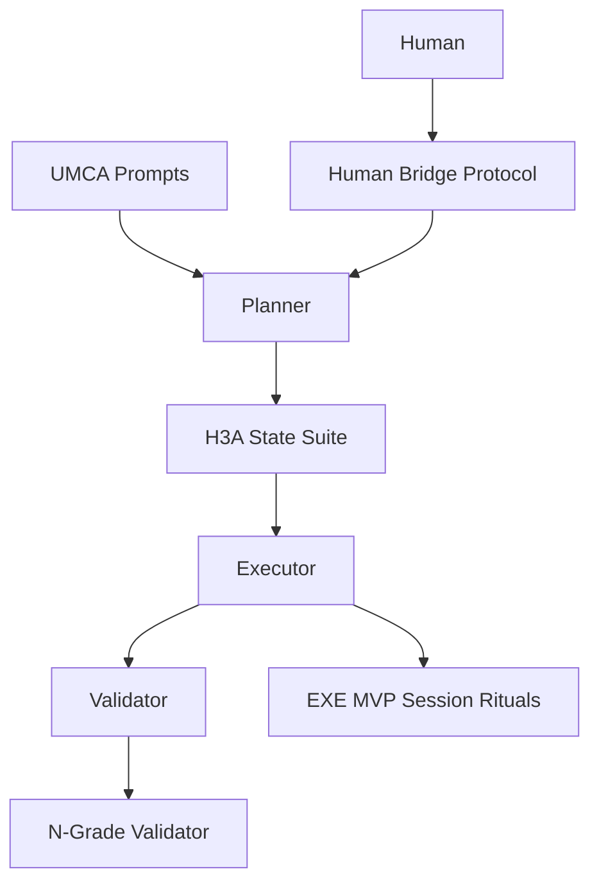

# Workflow Systems Comparative Analysis Report

## Table of Contents
1. [Executive Summary](#executive-summary)
2. [Detailed Analysis](#detailed-analysis)
   1. [05_project_UMCA](#05_project_umca)
   2. [04_project-h3a_distribution](#04_project-h3a_distribution)
   3. [03_project-exe_mvp](#03_project-exe_mvp)
   4. [02_project-N-Grade_contract](#02_project-n-grade_contract)
   5. [01_project-Agentic_prompt_guide](#01_project-agentic_prompt_guide)
3. [Comparative Analysis](#comparative-analysis)
4. [Synthesis & Recommendations](#synthesis--recommendations)
5. [Appendices](#appendices)

\pagebreak

## Executive Summary

### Mission Context
This report evaluates five workflow systems that collectively span prompt architecture, multi-agent orchestration, contract enforcement, state management, and human verification. The objective is to synthesize their strengths into a unified workflow suitable for production-grade AI-assisted software delivery.

### Key Findings
- **Unified Excellence Layer (UMCA) vs. Operational Enforcement (N-Grade):** UMCA excels at role-specialized, schema-driven prompts that codify enterprise guardrails, while the N-Grade contract system delivers machine-verifiable enforcement of deliverable quality and compliance.【F:docs/05_project_UMCA/08_master_coordinator_assistant_excellence_system_prompt.md†L1-L120】【F:docs/02_project-N-Grade_contract/examples/roadmap_v2_complete_expansion/contract.json†L1-L210】
- **H3A Provides Production-Grade Runbook Discipline:** The Hybrid 3-Agent system blends MCA and dual-agent patterns with strict gatekeeping, evidence trails, and atomic state management, making it the most mature multi-agent orchestration model among the five projects.【F:docs/04_project-h3a_distribution/docs/H3A_System/README.md†L1-L210】
- **Executor MVP Demonstrates Lightweight State & Session Hygiene:** The EXE MVP focuses on practical session protocols, JSON checkpoints, and developer ergonomics, offering an adaptable baseline for teams without heavy infrastructure.【F:docs/03_project-exe_mvp/state_management/SESSION_PROTOCOL.md†L1-L40】
- **Agentic Prompt Guide Establishes Behavioral Guardrails:** The prompt guide enforces TDD-first execution, iteration limits, and quality rituals that align well with both H3A and N-Grade governance expectations.【F:docs/01_project-Agentic_prompt_guide/ai-coding-prompt-guide.md†L1-L120】

### Primary Recommendation
Adopt an integrated workflow that uses **UMCA’s role-specialized prompt hierarchy** as the planning and governance layer, **H3A’s gated state machine** as the orchestration backbone, **N-Grade contracts** for delivery enforcement, **Agentic Prompt Guide** rituals for agent behavior, and **EXE MVP session tooling** for lightweight execution contexts. This combination balances rigor with adaptability.

### Critical Next Steps
1. Stand up a pilot repository instrumented with H3A run structure and EXE MVP session protocols.
2. Author consolidated system prompts using UMCA formats that explicitly reference Agentic Prompt Guide rituals and N-Grade contract obligations.
3. Implement N-Grade validator in the pilot and map H3A gate evidence to contract quality gates.
4. Draft migration playbooks for legacy dual-agent workflows, emphasizing backward compatibility outlined in H3A and UMCA documentation.
5. Establish governance council to own the merged workflow, including change management and compliance audits.

\pagebreak

## Detailed Analysis

### 05_project_UMCA

#### A. Project Overview
- **Purpose:** Provide excellence-grade system prompts for specialized roles (research, architecture, security, quality, data, coordination, finance) to orchestrate enterprise AI initiatives.【F:docs/05_project_UMCA/08_master_coordinator_assistant_excellence_system_prompt.md†L1-L150】
- **Maturity Level:** Production-ready; prompts follow mandatory structures, binary gates, and compliance mappings.
- **Target Audience:** Master coordinator, AI process architect, and supporting specialist assistants across the enterprise.
- **Core Philosophy:** Schema-first, excellence-driven operations with explicit compliance, evidence requirements, and escalation protocols.

#### B. Workflow Structure
| Role | Description | Interactions |
| --- | --- | --- |
| Master Coordinator Assistant (MCA) | Orchestrates gates G0-G8, consolidates handoffs, enforces compliance.【F:docs/05_project_UMCA/08_master_coordinator_assistant_excellence_system_prompt.md†L120-L240】 | Receives outputs from specialized assistants, routes work to next gate. |
| Specialist Assistants (Research, Architecture, Security, Quality, Database, FinOps) | Each ensures excellence in domain-specific deliverables with strict formats and edge-case protocols.【F:docs/05_project_UMCA/05_quality_assistant_excellence_system_prompt.md†L1-L160】 | Provide evidence and artifacts back to MCA and downstream roles. |
| AI Process Architect (APA) | Designs system prompts, integration schemas, and gate definitions for other assistants.【F:docs/05_project_UMCA/09_ai_process_architect_excellence_system_prompt.md†L1-L140】 | Works with MCA to update governance, interacts with FinOps and QA prompts. |
| Human Stakeholders | Approve escalations, supply missing data, and authorize compliance waivers per delivery notes.【F:docs/05_project_UMCA/11b_delivery_notes.md†L1-L60】 | Receive summarized briefs and risk assessments. |

- **Decision Points:** Each gate (G0-G8) requires binary pass/fail with evidence before escalation.
- **Hierarchies:** MCA sits above specialist assistants; APA defines prompt governance for all.

#### C. State Management
- **State Artifacts:** Emphasizes structured prompts and delivery notes; relies on MCA gate checklists but delegates run-state to downstream systems like H3A.
- **Transitions:** Gate progression tied to evidence packages; each assistant returns structured outputs to MCA for validation.
- **Persistence:** Prompts require audit-ready records (hashes, citations) but do not define specific storage beyond references in delivery notes.
- **Recovery Mechanisms:** Edge-case protocols for missing schema compliance, ambiguous requirements, or integration failures.
- **Session Handling:** Not prescriptive; assumes downstream systems (e.g., H3A) manage run state.

#### D. Contract/Protocol Mechanisms
- **Contract Types:** Mandatory prompt templates with binary quality gates and compliance mappings per assistant.
- **Validation:** Self-validation sequences embedded in prompts; MCA cross-checks gate evidence.
- **Enforcement:** Failure to meet any gate halts progress; escalation protocols to humans or APA.
- **Flexibility:** Structured but extensible through APA updates and delivery notes.

#### E. Quality Assurance
- **Quality Gates:** Detailed checklists (e.g., QA prompt requires mutation scores, security scans).【F:docs/05_project_UMCA/05_quality_assistant_excellence_system_prompt.md†L120-L220】
- **Review Processes:** Multi-role review—MCA verifies artifacts, APA ensures prompt adherence.
- **Testing Requirements:** Domain-specific (e.g., QA assistant enforces coverage, mutation testing; Security prompt enforces threat modeling).
- **Documentation Standards:** Mandatory sections, citations, and evidence logging.

#### F. Human-AI Interaction
- **Human Touchpoints:** Approval of escalations, compliance exceptions, budget governance.
- **Handoff Protocols:** Defined via MCA prompts; each assistant outputs artifacts for next role.
- **Escalation Paths:** Edge-case protocols specify human escalation triggers.
- **Verification Mechanisms:** Humans rely on binary gates, evidence logs, and delivery notes.

#### G. Technical Artifacts
- Role-specific system prompts (11-section formats, compliance mappings).【F:docs/05_project_UMCA/07_database_assistant_excellence_system_prompt.md†L1-L180】
- Delivery notes summarizing prompt deliveries with artifact paths.
- Integrated compliance references (e.g., FinOps, OWASP, ISO, EU AI Act).

#### H. Strengths & Weaknesses
- **Strengths:** Comprehensive governance, reusable prompt templates, enterprise compliance integration.
- **Weaknesses:** Lacks concrete state tooling; assumes integration with other systems for execution.
- **Unique Features:** Excellence format with binary gates and edge-case protocols per role.

\pagebreak

### 04_project-h3a_distribution

#### A. Project Overview
- **Purpose:** Deliver a production-grade Hybrid 3-Agent (Planner, Executor, Validator) workflow with human bridge protocols and gate enforcement.【F:docs/04_project-h3a_distribution/docs/H3A_System/README.md†L1-L210】
- **Maturity Level:** Production-ready (Phases 1-4 complete) with comprehensive documentation and tooling.
- **Target Audience:** AI agents, human operators, and developers adopting H3A run structure.
- **Core Philosophy:** Evidence-based progression through gates, atomic state management, human-in-the-loop validation.

#### B. Workflow Structure
| Role | Description | Interactions |
| --- | --- | --- |
| Planner Agent | Creates roadmap, decomposes tasks, defines TDD plans, populates CURRENT_TASK.json.【F:docs/04_project-h3a_distribution/prompts/planner_prompt.md†L1-L120】 | Hands off to Executor via SESSION_HANDOFF.json. |
| Executor Agent | Implements tasks via mandatory TDD cycle, records artifacts, updates executor_report.json.【F:docs/04_project-h3a_distribution/prompts/executor_prompt.md†L1-L120】 | Delivers evidence for Validator. |
| Validator Agent | Performs zero-trust verification (10-point checklist), writes validator_report.json.【F:docs/04_project-h3a_distribution/prompts/validator_prompt.md†L1-L120】 | Accepts or rejects tasks, escalates after two failures. |
| Human Bridge | Executes handoff protocol, verifies gate criteria, invokes next agent.【F:docs/04_project-h3a_distribution/docs/H3A_System/Human_Bridge_Protocol.md†L1-L200】 | Acts as governance layer between agents. |

- **Decision Points:** Gates G0 (Planning), G1 (Implementation), G2 (Validation), G3 (Production) with pass/fail logs in GATES_LEDGER.md.
- **Hierarchies:** Planner → Executor → Validator sequence enforced; humans oversee transitions.

#### C. State Management
- **State Artifacts:** ROADMAP.md, CURRENT_TASK.json, GATES_LEDGER.md, EVIDENCE_LOG.md, SESSION_HANDOFF.json, state.json, agent reports, artifacts directories.【F:docs/04_project-h3a_distribution/docs/H3A_System/state_specification.md†L1-L120】
- **State Transitions:** Atomic writes with append-only history; gate status updates recorded in ledger.
- **Persistence Mechanisms:** Atomic write helpers, SHA hashes in evidence log, directories per run ID.
- **Recovery Mechanisms:** Human bridge protocol covers rejection loops; initialization script ensures integrity.
- **Session Handling:** Human Bridge enforces start/end rituals; max two iterations before escalation.

#### D. Contract/Protocol Mechanisms
- **Contract Types:** Handoff contracts for planner→executor→validator specifying obligations.【F:docs/04_project-h3a_distribution/docs/H3A_System/handoff_contracts.md†L1-L200】
- **Validation:** Gate framework defines entry/exit evidence; validator re-runs commands.
- **Enforcement:** Gate ledger and iteration limits; rejection flows documented.
- **Flexibility:** Backwards compatible with dual-agent workflows; extensible gate definitions.

#### E. Quality Assurance
- **Quality Gates:** 10-point validator checklist, coverage delta, mutation thresholds, security scans.【F:docs/04_project-h3a_distribution/prompts/validator_prompt.md†L80-L160】
- **Review Processes:** Independent validation, human oversight, evidence logging.
- **Testing Requirements:** TDD evidence, coverage ≥90%, mutation ≥85%, lint/type checks.
- **Documentation Standards:** Artifacts recorded with hashes; run README summarizes workflow.

#### F. Human-AI Interaction
- **Human Touchpoints:** Bridge protocol, validation of handoffs, escalation after failed gates.
- **Handoff Protocols:** Detailed step-by-step bridging procedures with command verification.【F:docs/04_project-h3a_distribution/docs/H3A_System/Human_Bridge_Protocol.md†L80-L200】
- **Escalation Paths:** Rejection logs, iteration limit triggers human review.
- **Verification Mechanisms:** Humans run verification checklists and confirm evidence presence.

#### G. Technical Artifacts
- Scripts (`h3a_init.py`) generating run directories with atomic writes.【F:docs/04_project-h3a_distribution/scripts/h3a_init.py†L1-L220】
- Extensive documentation (Quick Start, Migration Guide, Gate Framework, Human Verification Checklist).
- Prompts for agents with operational playbooks.

#### H. Strengths & Weaknesses
- **Strengths:** Comprehensive state management, strict gatekeeping, compatibility with prior systems, detailed human protocols.
- **Weaknesses:** Heavyweight to adopt without automation; requires disciplined human involvement.
- **Unique Features:** Evidence log with hashes, human bridge protocol, 10-point validation checklist.

\pagebreak

### 03_project-exe_mvp

#### A. Project Overview
- **Purpose:** Provide a minimal executor agent MVP with UI, JSON contracts, and session protocols to run locally.【F:docs/03_project-exe_mvp/mvp_delivery_notes.md†L1-L60】
- **Maturity Level:** MVP but deployable; includes roadmap for next iterations.
- **Target Audience:** Developers needing lightweight executor plus state hygiene.
- **Core Philosophy:** Pragmatic TDD execution with Ajv schema validation, sandboxed file writes, and human-readable state rituals.

#### B. Workflow Structure
| Role | Description | Interactions |
| --- | --- | --- |
| Executor Agent | Runs via Node/TypeScript server, enforces JSON schema, writes files to output. | Interfaces with LLM providers via prompts. |
| Human Operator | Follows session protocol (NOW/NEXT/DECISIONS files), runs commands, updates state logs.【F:docs/03_project-exe_mvp/state_management/SESSION_PROTOCOL.md†L1-L40】 | Maintains state hygiene and handoff readiness. |
| Validator (future) | Proposed via roadmap to add CI tests and gating. | Consumes executor outputs for verification. |

- **Decision Points:** Session protocol includes verification (typecheck, lint, build) before end-of-session updates.
- **Hierarchies:** Human operator coordinates; executor agent acts as tactical worker.

#### C. State Management
- **State Artifacts:** NOW.md, NEXT.md, DECISIONS.md, session JSON snapshots, handoff template, script validator.【F:docs/03_project-exe_mvp/state_management/NOW.md†L1-L20】【F:docs/03_project-exe_mvp/state_management/session/2025-10-01.json†L1-L20】
- **Transitions:** Startup ritual reading state, declaring intent; end ritual updating files; script ensures presence.
- **Persistence Mechanisms:** Append-only decisions log; JSON snapshots with tokens/time metadata.
- **Recovery Mechanisms:** Session files allow cold start; script `check-state.sh` verifies readiness.【F:docs/03_project-exe_mvp/state_management/delivery_notes.md†L50-L120】
- **Session Handling:** Explicit start/work/end phases; handshake ensures new agent can resume.

#### D. Contract/Protocol Mechanisms
- **Contract Types:** Minimal JSON schema for executor outputs; session protocol acts as soft contract.
- **Validation:** Ajv schema enforcement; manual verification via session checklist.
- **Enforcement:** Failing lint/test prevents healthy state; script enforces file presence.
- **Flexibility:** Lightweight; easy to integrate with other systems.

#### E. Quality Assurance
- **Quality Gates:** Typecheck, lint, build commands run per session; roadmap emphasizes adding CI and tests.【F:docs/03_project-exe_mvp/state_management/DECISIONS.md†L1-L20】
- **Review Processes:** Human operator ensures compliance; decisions log records verification status.
- **Testing Requirements:** Encourages TDD with Ajv schema; future CI tasks in roadmap.
- **Documentation Standards:** Templates for handoff and session JSON; decisions log.

#### F. Human-AI Interaction
- **Human Touchpoints:** High involvement—human runs commands, updates state, ensures compliance.
- **Handoff Protocols:** Handoff template ensures consistent state transfer.
- **Escalation Paths:** Manual; decisions log notes risks or blockers.
- **Verification Mechanisms:** Command verification and script-based state check.

#### G. Technical Artifacts
- Executor system prompt, UI, server, schema (available via delivery notes download).【F:docs/03_project-exe_mvp/mvp_delivery_notes.md†L20-L60】
- State management documentation suite.

#### H. Strengths & Weaknesses
- **Strengths:** Lightweight adoption, clear state ritual, practical tooling for local runs.
- **Weaknesses:** Lacks automated validation depth; depends on human discipline; limited role differentiation.
- **Unique Features:** NOW/NEXT/DECISIONS cycle, session snapshots with tokens/time, Ajv schema gating.

\pagebreak

### 02_project-N-Grade_contract

#### A. Project Overview
- **Purpose:** Enforce contract-based deliveries with strict validator, schemas, and quality gates for documentation and code outputs.【F:docs/02_project-N-Grade_contract/README.md†L1-L120】
- **Maturity Level:** Production-ready; includes validator script, templates, example contracts, and instruction prompts.
- **Target Audience:** Coordinators and agents delivering artifacts requiring verifiable quality gates.
- **Core Philosophy:** Zero-tolerance contract enforcement, machine-verifiable compliance, explicit forbidden/required patterns.

#### B. Workflow Structure
| Role | Description | Interactions |
| --- | --- | --- |
| Contract Author | Defines deliverable requirements via JSON contracts/templates.【F:docs/02_project-N-Grade_contract/contracts/template.contract.json†L1-L80】 | Provides to executor agents. |
| Executor Agent | Produces deliverables adhering to contract; uses instruction prompt to understand gates.【F:docs/02_project-N-Grade_contract/examples/roadmap_v2_complete_expansion/instruction_prompt.md†L1-L160】 | Runs validator to self-check. |
| Validator Script (`validate_contract.py`) | Verifies deliverable compliance, produces reports.【F:docs/02_project-N-Grade_contract/SETUP.md†L80-L140】 | Provides exit code gating acceptance. |
| Human Reviewer | Receives validation reports, handles escalations, updates contracts. |

- **Decision Points:** Validator exit code (0 accept, 1 reject). Quality gates include line counts, patterns, structural requirements.
- **Hierarchies:** Contracts drive work; validator enforces; humans oversee.

#### C. State Management
- **State Artifacts:** Contracts directory, schema, validation reports, instruction prompts, examples.
- **State Transitions:** Deliverable produced → validator run → report generated → acceptance status recorded in return payload structure.【F:docs/02_project-N-Grade_contract/examples/roadmap_v2_complete_expansion/validation_report.json†L1-L80】
- **Persistence Mechanisms:** Reports stored under `_reports/`; schema references ensure consistent validation.
- **Recovery Mechanisms:** Instruction prompts detail remediation steps; validator loops until exit code 0.
- **Session Handling:** Focus on deliverable-level contracts rather than interactive sessions.

#### D. Contract/Protocol Mechanisms
- **Contract Types:** JSON contracts with deliverables, quality gates, cross-file validations, DoD status, additional requirements.【F:docs/02_project-N-Grade_contract/examples/roadmap_v2_complete_expansion/contract.json†L1-L260】
- **Validation:** Python validator with Ajv-style checks, cross-file validations, forbidden/required patterns.
- **Enforcement:** Exit codes, zero-tolerance forbidden patterns, machine-readable return payload.
- **Flexibility:** Template allows customization; instruction prompt template supports adaptation.

#### E. Quality Assurance
- **Quality Gates:** Line counts, pattern counts, structural requirements, cross-file validations, DoD metrics.
- **Review Processes:** Validator reports provide evidence; humans review only after automated acceptance.
- **Testing Requirements:** Encourages creation of test contracts and validation commands via README/SETUP guidance.【F:docs/02_project-N-Grade_contract/SETUP.md†L120-L190】
- **Documentation Standards:** Contracts and instructions require explicit thresholds and evidence paths.

#### F. Human-AI Interaction
- **Human Touchpoints:** Approval of contracts, handling escalations when validator fails repeatedly.
- **Handoff Protocols:** Instruction prompts specify bridging content and verification sequences.
- **Escalation Paths:** After repeated failures, escalate with validation report details.
- **Verification Mechanisms:** Automated validator plus manual review of reports.

#### G. Technical Artifacts
- Schema, contract templates, validator script, setup docs, instruction prompts, example contract+report.
- Path conventions and migration notes for repository integration.

#### H. Strengths & Weaknesses
- **Strengths:** Strong enforcement, reusable templates, comprehensive instruction prompts.
- **Weaknesses:** Heavyweight for small tasks; requires strict adherence to JSON schema.
- **Unique Features:** Return payload structure, cross-file validation rules, zero-tolerance forbidden patterns.

\pagebreak

### 01_project-Agentic_prompt_guide

#### A. Project Overview
- **Purpose:** Provide agentic prompt guidance emphasizing TDD, planner-executor collaboration, and quality rituals.【F:docs/01_project-Agentic_prompt_guide/ai-coding-prompt-guide.md†L1-L160】
- **Maturity Level:** Mature reference with multiple prompts, checklists, gap analyses.
- **Target Audience:** Planner and executor agents, human reviewers ensuring TDD compliance.
- **Core Philosophy:** TDD-first execution, planner/executor separation, human verification, strict iteration protocols.

#### B. Workflow Structure
| Role | Description | Interactions |
| --- | --- | --- |
| Planner | Emits precise instructions following plan-then-patch flow, references TDD rules.【F:docs/01_project-Agentic_prompt_guide/planner_ai_minimal_guide.md†L1-L120】 | Hands off to executor with minimal schema. |
| Executor | Follows TDD cycle, runs tests/gates, produces PR notes.【F:docs/01_project-Agentic_prompt_guide/Executor_system_prompt.md†L1-L160】 | Reports status back to human reviewers. |
| Human Reviewer | Uses verification checklist to confirm TDD evidence and quality gates.【F:docs/01_project-Agentic_prompt_guide/Human_Verification_Checklist.md†L1-L140】 | Approves or rejects deliverables. |

- **Decision Points:** TDD phases (RED, GREEN, REFACTOR), gate runs (tests, lint, build), iteration limit after two failures.
- **Hierarchies:** Planner instructs executor; human verifies; iteration rules enforce discipline.

#### C. State Management
- **State Artifacts:** Prompts emphasize minimal state; rely on planner/executor outputs and PR notes.
- **State Transitions:** Planner issues plan; executor returns diff, runs gates, reports status.
- **Persistence Mechanisms:** Encourages logs, PR notes, artifacts with evidence.
- **Recovery Mechanisms:** Rules for failure escalation after two iterations.
- **Session Handling:** Plan-then-patch sequence with waiting for approval.

#### D. Contract/Protocol Mechanisms
- **Contract Types:** Implicit contracts via Definition of Done checklists and TDD compliance rules.
- **Validation:** Human verification checklist ensures TDD, tests, gates, artifacts.【F:docs/01_project-Agentic_prompt_guide/Human_Verification_Checklist.md†L20-L100】
- **Enforcement:** Work rejected if RED→GREEN evidence missing or gates fail; planner ensures diff-only outputs.
- **Flexibility:** Provides model-specific tips and troubleshooting guidelines.

#### E. Quality Assurance
- **Quality Gates:** Tests, lint, build, mutation, security, accessibility depending on repo context.【F:docs/01_project-Agentic_prompt_guide/TDD_Quick_Reference_Card.md†L1-L120】
- **Review Processes:** Human verification checklist with explicit criteria.
- **Testing Requirements:** Mandatory failing test before implementation, full suite after changes.
- **Documentation Standards:** PR notes format, artifact lists, descriptive test names.

#### F. Human-AI Interaction
- **Human Touchpoints:** Approves plans, verifies deliverables, enforces checklists.
- **Handoff Protocols:** Planner output schema ensures executor receives precise instructions.
- **Escalation Paths:** After two failed attempts, agent must pause and request human help.【F:docs/01_project-Agentic_prompt_guide/ai-coding-prompt-guide.md†L200-L260】
- **Verification Mechanisms:** Human checklist verifying logs, tests, artifacts.

#### G. Technical Artifacts
- System prompts, quick reference cards, gap analysis, chat logs illustrating use.

#### H. Strengths & Weaknesses
- **Strengths:** Strong behavioral guardrails, TDD enforcement, human verification clarity.
- **Weaknesses:** Limited explicit state structure; assumes other systems manage run artifacts.
- **Unique Features:** Plan-then-patch rule, iteration limit, PR_NOTE template with TDD evidence.

\pagebreak

## Comparative Analysis

### Cross-Project Pattern Identification
- **Common Patterns (3+ projects):**
  - **TDD Enforcement:** Agentic Prompt Guide, H3A, EXE MVP (roadmap), and UMCA (specialist prompts) all mandate RED→GREEN cycles and evidence.【F:docs/01_project-Agentic_prompt_guide/Executor_system_prompt.md†L40-L100】【F:docs/04_project-h3a_distribution/prompts/executor_prompt.md†L20-L120】【F:docs/05_project_UMCA/05_quality_assistant_excellence_system_prompt.md†L80-L160】
  - **Evidence Logging:** H3A’s EVIDENCE_LOG, N-Grade validation reports, UMCA delivery notes, EXE MVP decisions log.
  - **Iteration Limits/Escalation:** Agentic Prompt Guide (two attempts), H3A (two iterations), UMCA edge-case protocols, N-Grade validator escalation instructions.
  - **Compliance Orientation:** UMCA (compliance mapping), H3A (audit artifacts), N-Grade (forbidden patterns), Agentic Guide (security gates).

- **Divergent Approaches:**
  - **State Management:** H3A offers comprehensive file-based state; EXE MVP provides lightweight session docs; UMCA relies on prompts; N-Grade focuses on contracts; Agentic Guide emphasizes behavioral flow.
  - **Automation vs. Ritual:** N-Grade automates validation via scripts; H3A mixes automation with human bridging; EXE MVP relies on human rituals; UMCA/Agentic rely on prompt discipline.
  - **Scope:** UMCA and H3A cover entire multi-agent lifecycle; N-Grade focuses on deliverables; EXE MVP on executor; Agentic Guide on prompt behavior.

### Role/Agent Comparison Matrix
| Role | UMCA | H3A | EXE MVP | N-Grade | Agentic Guide | Notes |
| --- | --- | --- | --- | --- | --- | --- |
| Planner/Coordinator | MCA, APA | Planner Agent | Human operator (planning via NOW/NEXT) | Contract author (partial) | Planner prompt | UMCA offers richest governance; H3A operationalizes; EXE MVP manual. |
| Executor/Developer | Specialist assistants (QA, Security) | Executor Agent | Executor MVP | Contract executors | Executor prompt | H3A & Agentic align on TDD; N-Grade enforces deliverable compliance. |
| Validator/QA | Quality assistant, MCA | Validator Agent | Pending CI | Validator script | Human reviewer | H3A’s validator + N-Grade script provide automation synergy. |
| Human Bridge/Reviewer | Stakeholders per prompt | Human Bridge | Human operator | Contract approver | Human verification checklist | Human oversight central in all except N-Grade automation layer. |

### State Management Comparison
| Dimension | Most Robust | Most Flexible | Easiest to Implement | Edge Case Handling |
| --- | --- | --- | --- | --- |
| Structure | H3A (comprehensive state suite) | EXE MVP (lightweight rituals) | Agentic Guide (minimal) | H3A (hashes, atomic writes) |
| Persistence | H3A atomic writes | EXE MVP manual updates | Agentic Guide (logs/PR notes) | N-Grade (validation reports) |
| Recovery | H3A iteration limits + logs | EXE MVP snapshot resume | Agentic Guide human intervention | N-Grade validator instructions |

### Contract/Protocol Comparison
| Criterion | Most Formal | Most Flexible | Best Validation | Complementarity |
| --- | --- | --- | --- | --- |
| Contract Type | N-Grade JSON contracts | Agentic behavioral contracts | N-Grade validator | N-Grade contracts + H3A gates align |
| Handoff Protocol | H3A handoff contracts | EXE MVP templates | H3A gate ledger | UMCA prompts define governance |
| Compliance | UMCA prompts | EXE MVP rituals | N-Grade schema | Combine UMCA compliance with N-Grade enforcement |

### Complexity Analysis (1-5 scale)
| Project | Implementation Complexity | Learning Curve | Operational Overhead | Flexibility | Robustness |
| --- | --- | --- | --- | --- | --- |
| UMCA | 4 | 4 | 4 | 3 | 4 |
| H3A | 5 | 4 | 4 | 3 | 5 |
| EXE MVP | 3 | 3 | 2 | 4 | 3 |
| N-Grade | 4 | 3 | 3 | 3 | 5 |
| Agentic Guide | 2 | 2 | 2 | 4 | 3 |

### Integration Compatibility
- **High Compatibility:**
  - UMCA governance + H3A orchestration: UMCA defines roles/gates, H3A provides run structure.
  - H3A validator + N-Grade contracts: H3A’s gate evidence can feed contract validation.
  - Agentic Prompt Guide + EXE MVP: Guide’s rituals match EXE MVP’s TDD expectations.
- **Potential Conflicts:**
  - Overlapping governance between UMCA MCA and H3A Planner; requires role alignment.
  - N-Grade’s rigid line counts may clash with lean tasks unless contracts are right-sized.
- **Dependencies:**
  - H3A requires initialization script (`h3a_init.py`) and human bridge discipline.
  - UMCA relies on APA to maintain prompt library.
  - N-Grade depends on Python environment, jsonschema library.
- **Technical Debt Risks:**
  - Maintaining multiple prompt libraries (UMCA) and ensuring they reference latest state structures.
  - Synchronizing contract templates with evolving gate definitions.

\pagebreak

## Synthesis & Recommendations

### Merge Strategy Overview
Integrate the five systems by layering **governance (UMCA)**, **orchestration (H3A)**, **behavioral discipline (Agentic Guide)**, **contract enforcement (N-Grade)**, and **developer ergonomics (EXE MVP)**.

#### Layered Architecture Proposal

- **UMCA Prompts:** Provide role definitions (MCA, APA, specialists) to configure Planner/Executor/Validator behaviors.
- **H3A State Suite:** Manage runs with ROADMAP, CURRENT_TASK, gate ledger, evidence log.
- **Agentic Prompt Guide:** Informs Planner/Executor prompts embedded in H3A’s agent instructions.
- **EXE MVP Rituals:** Apply to human operators managing sessions; embed NOW/NEXT/DECISIONS structure into H3A run README template.
- **N-Grade Validator:** Wraps deliverables (documents, code) with contracts triggered at G2/G3 gates.

### Adoption Roadmap
1. **Phase 0 – Pilot Setup (2 weeks):**
   - Configure repository with H3A initialization script and EXE MVP state files.
   - Import UMCA MCA, APA, and Quality prompts; adapt to H3A gate nomenclature.
   - Draft integrated Planner/Executor/Validator prompts referencing Agentic Guide rules.

2. **Phase 1 – Contract Integration (2 weeks):**
   - Create N-Grade contracts for key deliverables (roadmaps, validation reports).
   - Link H3A gate exit criteria to contract quality gates (line counts, forbidden patterns).
   - Automate validator execution as part of H3A G2 completion.

3. **Phase 2 – Governance & Compliance (3 weeks):**
   - Establish governance council (MCA + APA roles) to maintain prompt library and gate definitions.
   - Map compliance frameworks (ISO 42001, EU AI Act) to evidence logs and contracts.
   - Document escalation procedures aligning UMCA edge-case protocols with H3A iteration limits.

4. **Phase 3 – Scaling & Tooling (ongoing):**
   - Build dashboards using H3A evidence logs and N-Grade reports.
   - Expand EXE MVP tooling (CI integration, artifact uploads) to automate parts of H3A gates.
   - Introduce analytics for gate pass rates, iteration counts, and compliance metrics.

### What to Adopt
- **UMCA:** Keep excellence prompt structure, compliance mappings, and APA governance role.
- **H3A:** Adopt entire state suite, gate framework, human bridge protocol, validator prompt.
- **Agentic Guide:** Integrate plan-then-patch pattern, TDD enforcement, human verification checklist.
- **EXE MVP:** Use NOW/NEXT/DECISIONS artifacts and session scripts as lightweight interface for humans.
- **N-Grade:** Use contracts and validator for final acceptance gates and large deliverables.

### What to Deprecate or Modify
- **Redundant Prompts:** Consolidate overlapping instructions between Agentic Guide and H3A prompts into unified Planner/Executor templates.
- **Legacy Dual-Agent Init Scripts:** Replace with `h3a_init.py` for new runs while maintaining migration guide for old runs.
- **Loose Documentation:** Retire ad-hoc notes in favor of formal N-Grade contracts and UMCA delivery notes.

### Net-New Elements Needed
- **Unified Prompt Library:** Repository containing merged Planner/Executor/Validator prompts referencing UMCA excellence sections.
- **Contract Catalog:** Standard N-Grade contracts for gate outputs (planner report, executor report, validator verdict).
- **Automation Scripts:** CLI to trigger H3A init, update NOW/NEXT/DECISIONS, and run N-Grade validator automatically.
- **Governance Dashboard:** Visualize gate status, evidence completeness, contract compliance.

### Risk Assessment
- **Technical Risks:**
  - Integration complexity between prompts and state files → Mitigation: create automated linting for prompt references and schema checks.
  - Validator false positives due to stringent patterns → Mitigation: provide exception workflows and adjustable thresholds.
- **Adoption Risks:**
  - Steep learning curve for H3A and UMCA prompts → Mitigation: phased onboarding, training materials, pairing sessions.
  - Resistance to contract rigidity → Mitigation: start with high-impact deliverables, demonstrate value via reduced rework.
- **Maintenance Risks:**
  - Prompt drift as standards evolve → Mitigation: APA owns versioning, periodic reviews.
  - Evidence log bloat → Mitigation: archiving policy, tooling for summarizing runs.

\pagebreak

## Appendices

### Appendix A: Feature Comparison Matrix
| Feature | UMCA | H3A | EXE MVP | N-Grade | Agentic Guide |
| --- | --- | --- | --- | --- | --- |
| Role-Specific Prompts | ✅ | ✅ | ⚪ | ⚪ | ✅ |
| Gate Framework | ✅ (G0-G8) | ✅ (G0-G3) | ⚪ | ⚪ | ⚪ |
| Contract Enforcement | ⚪ | ⚪ | ⚪ | ✅ | ⚪ |
| State Files | ⚪ | ✅ | ✅ | ⚪ | ⚪ |
| Human Bridge Protocol | ⚪ | ✅ | ⚪ | ⚪ | ⚪ |
| TDD Mandate | ✅ | ✅ | ✅ (planned) | ✅ (via required tests) | ✅ |
| Compliance Mapping | ✅ | ✅ | ⚪ | ✅ | ⚪ |
| Automation Scripts | ⚪ | ✅ (`h3a_init.py`) | ⚪ | ✅ (`validate_contract.py`) | ⚪ |

### Appendix B: File Inventory by Project
- **UMCA:** Specialized prompts (`01`–`11`), delivery notes, compliance references.【F:docs/05_project_UMCA/08_master_coordinator_assistant_excellence_system_prompt.md†L1-L240】【F:docs/05_project_UMCA/11b_delivery_notes.md†L1-L60】
- **H3A:** `docs/H3A_System/*.md`, `prompts/*.md`, `scripts/h3a_init.py`.
- **EXE MVP:** `docs/state_management/*.md`, session JSONs, `mvp_delivery_notes.md`.
- **N-Grade:** `contracts/*.json`, `examples/roadmap_v2_complete_expansion/*`, instruction templates.【F:docs/02_project-N-Grade_contract/examples/roadmap_v2_complete_expansion/contract.json†L1-L260】
- **Agentic Guide:** Planner/executor prompts, verification checklists, quick references.【F:docs/01_project-Agentic_prompt_guide/Human_Verification_Checklist.md†L1-L120】

### Appendix C: Glossary of Terms
- **APA:** AI Process Architect (UMCA role defining prompt architecture).
- **H3A:** Hybrid 3-Agent system (Planner, Executor, Validator with human bridge).
- **Gates (G0-G3/G0-G8):** Stage-specific approval checkpoints with evidence requirements.
- **TDD:** Test-Driven Development (RED→GREEN→REFACTOR cycle).
- **Evidence Log:** File capturing artifact hashes for verification (H3A).
- **N-Grade Contract:** JSON structure defining deliverable quality gates and validation rules.
- **Session Protocol:** Ritual ensuring state continuity between human/agent sessions (EXE MVP).

### Appendix D: Quick Reference Guide
- **Start a Run:** `python scripts/h3a_init.py --task-brief "<task>"` → follow EXE MVP session startup → review UMCA MCA brief.
- **Plan Work:** Use UMCA Planner prompt referencing Agentic Guide TDD plan → populate ROADMAP.md and CURRENT_TASK.json.
- **Execute:** Run Executor agent under H3A prompt → follow Agentic TDD cycle → log evidence.
- **Validate:** Invoke Validator agent → run N-Grade validator on resulting deliverables → update EVIDENCE_LOG.md.
- **Handoff:** Human bridge executes checklist, updates SESSION_HANDOFF.json, ensures NOW/NEXT/DECISIONS reflect status.

\pagebreak

*End of Report*
