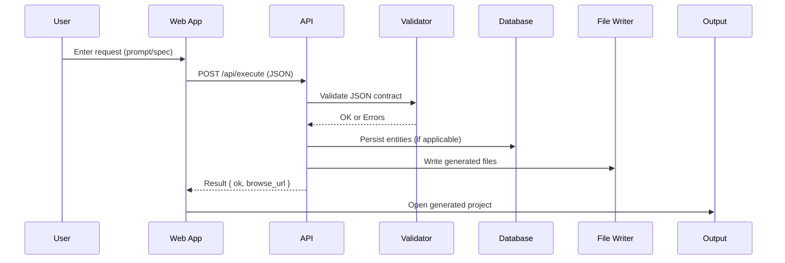

# Technical Specifications — Template

Purpose: Provide clear, actionable specifications for any app generated by the Executor. Copy this section into the project’s `docs/` and fill in.

## 1) Functional Requirements
- Core features: List each feature, user story, and priority.
- Roles/permissions: Define user types, access, and restrictions.
- Data model overview: Entities and relationships (link to schema).
- API endpoints: Operations, inputs/outputs, and error codes.

## 2) Non-Functional Constraints
- Performance targets: Latency, throughput, cold-start limits.
- Reliability: Error budgets, SLOs, retry/backoff policies.
- Security: Auth, secrets, PII handling, data retention.
- Compliance: Logging, audit trail, data residency.

## 3) UI/UX Baseline
- Navigation model: Primary routes and states.
- Accessibility: Contrast, keyboard navigation, ARIA, focus management.
- Responsiveness: Mobile/desktop breakpoints and behavior.
- Empty/loading/error states: Behavior and messages.

## 4) Architecture Overview
High-level components and flows for the Executor-generated apps.

```mermaid
graph TD
  User[Browser/UI] --> WebApp[Frontend]
  WebApp --> API[Express API]
  API --> Validator[Schema (Ajv/Zod)]
  API --> DB[(Prisma/SQLite)]
  API --> Files[Write Files]
  Files --> Output[(output/<project>)]
  WebApp --> OutputViewer[/Static Output Browser/]
```

## 5) Data Flow Specification



## 6) API Contract Policy
- Strict JSON-only responses.
- Validation-first: reject invalid payloads clearly with 4xx codes and structured error bodies.
- Idempotency and pagination where relevant.

## 7) Persistence
- Prisma schema documented and versioned.
- Migration strategy: `prisma db push` locally, migrations in CI/CD.
- Test DB isolation for unit/integration tests.

## 8) Security & Config
- Env handling: `.env.example`, never commit secrets.
- CORS and session/security headers.
- Secret rotation and least privilege.

## 9) Acceptance Criteria
- Each core feature has success cases and failure modes.
- All endpoints return expected shapes and status codes.
- Observability logs show no errors at INFO level during happy paths.
- Perf targets met in baseline perf test.

## 10) Testing Protocols
- Unit: Functions/utilities with deterministic inputs/outputs.
- Integration: API routes with real validation and DB (test.sqlite).
- E2E: Browser flows (Playwright), critical paths.
- Negative tests: Validation failures and auth checks.